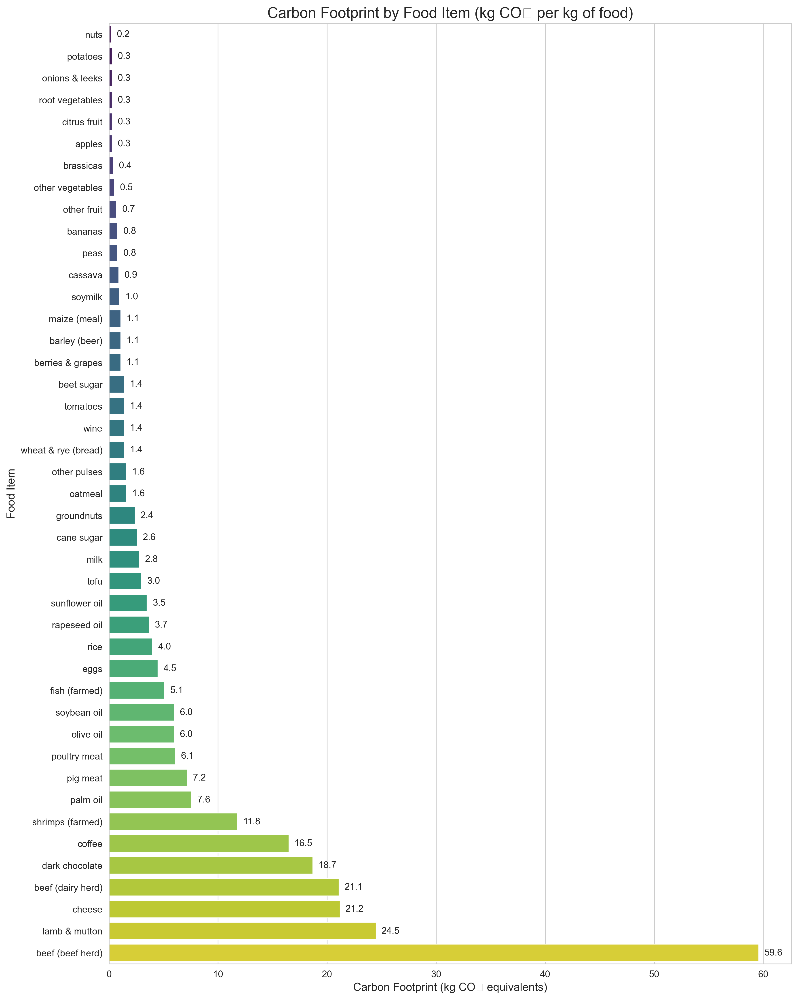

# Food Carbon Footprint Calculator

Calculate and visualize the carbon footprint of meals based on food items and their quantities. This tool helps you make environmentally conscious food choices by providing insights into the climate impact of different foods.

This work was completed as part of the course "Python Programming for Calculations" at the University of South-Eastern Norway.



## 📋 Table of Contents

- [Overview](#overview)
- [Features](#features)
- [Installation](#installation)
- [Usage](#usage)
- [Data Source](#data-source)
- [Examples](#examples)
- [Contributing](#contributing)
- [License](#license)

## 🌍 Overview

Food production is responsible for approximately 25% of global greenhouse gas emissions. This tool allows you to calculate and visualize the carbon footprint of your meals, helping you understand the environmental impact of your food choices and identify ways to reduce it.

The calculator uses data on greenhouse gas emissions per kilogram of different food products to estimate the carbon footprint of meals based on the foods and quantities consumed.

## ✨ Features

- **Calculate Carbon Footprint**: Measure the carbon footprint of meals based on food items and quantities
- **Interactive Interface**: User-friendly command-line interface for entering meal details
- **Visualizations**: Generate informative charts showing:
  - Comparison of carbon footprints across different food items
  - Breakdown of a meal's carbon footprint by ingredient
  - Comparison of different meals' carbon footprints
- **Suggestions**: Get recommendations for lower-carbon alternatives to high-impact foods
- **Data Export**: Save results to Excel for further analysis
- **Meal Comparison**: Compare multiple meals to identify the most climate-friendly options

## 🛠️ Installation

### Prerequisites

- Python 3.9 or higher

### Setup

1. Clone the repository:
   ```bash
   git clone https://github.com/MeenaBana/carbon-footprint-calculation.git
   cd carbon-footprint-calculation
   ```

2. Install the required packages:
   ```bash
   pip install -r requirements.txt
   ```

## 🚀 Usage

### Basic Usage

Run the carbon footprint calculator:

```bash
python src\carbon_footprint_calculator.py
```

This will start an interactive session where you can:
1. Enter the name of your meal
2. Select food items from the available list
3. Specify quantities for each item
4. View the calculated carbon footprint and breakdown
5. Get visualizations of the results

### Comparing Meals

To compare multiple meals:

```bash
python src\meal_comparison.py
```

This tool allows you to:
1. Add multiple meals to compare
2. Visualize the carbon footprint differences between meals
3. See which meal has the lowest environmental impact
4. Identify which ingredients contribute most to the carbon footprint

### Command-line Arguments

Both scripts support additional command-line arguments:

```bash
python src\carbon_footprint_calculator.py --data "..\data\Food_Production.csv"
python src\carbon_footprint_calculator.py --visualize-only  # Only generate food comparison chart
```

## 📊 Data Source

The calculator uses data from the "Environmental Impact of Food Production" dataset available on Kaggle. This dataset contains information on greenhouse gas emissions, land use, water use, and eutrophying emissions for various food products.

The carbon footprint is measured in kg CO₂ equivalents per kg of food product, accounting for:
- Land use change
- Animal feed
- Farm operations
- Processing
- Transport
- Packaging
- Retail

## 📝 Examples

### Example 1: Breakfast Comparison

Compare the carbon footprint of different breakfast options:

```python
from compare_meals import MealComparisonTool

comparison = MealComparisonTool()

# Add different breakfast options
comparison.add_meal("Traditional Breakfast", [
    ("eggs", 0.1),
    ("pig meat", 0.1),
    ("milk", 0.2),
    ("wheat & rye (bread)", 0.1)
])

comparison.add_meal("Plant-based Breakfast", [
    ("oatmeal", 0.15),
    ("soymilk", 0.2),
    ("bananas", 0.1),
    ("berries & grapes", 0.05)
])

comparison.compare_meals()
comparison.plot_meal_comparison()
```

### Example 2: Calculating a Dinner's Carbon Footprint

```python
from carbon_footprint_calculator import CarbonFootprintCalculator

calculator = CarbonFootprintCalculator()

# Define a dinner
dinner_items = [
    ("beef (beef herd)", 0.2),
    ("potatoes", 0.3),
    ("tomatoes", 0.15),
    ("wine", 0.2)  # in kg equivalent
]

calculator.display_results("Steak Dinner", dinner_items)

calculator.plot_meal_breakdown("Steak Dinner", dinner_items)
```

---
